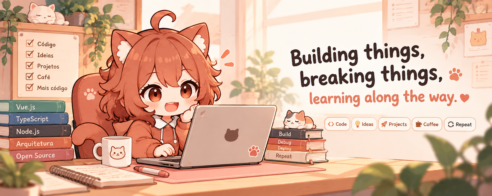

# Hi, I'm Thallys 👋

Senior Software Engineer focused on **Frontend, Full Stack and Software Architecture**, with 14+ years of experience building web, mobile and real-time products.

I've worked across fintech, banking, retail, SaaS, iGaming and consulting, contributing as both an engineer and technical leader.

I enjoy building **developer tools, open-source projects and products from scratch**, especially where frontend engineering, architecture and developer experience meet.

  

### Main stack

TypeScript · Vue.js · React · Node.js · Next.js · Nuxt

### What I'm building

🐱 **[Teracota](LINK_DO_REPO)** — Extensible desktop interface for AI coding agents, bringing tools like Claude Code, Codex and OpenCode into a unified desktop experience.

🟣 **[Vuelume](LINK_DO_REPO)** — Open-source visual editor for Vue applications that works directly with your source code, without introducing a proprietary runtime or lock-in.

⚒️ **[Hephaestus](LINK_DO_REPO)** — TypeScript-first 2D game engine and visual development platform for web and UI-oriented games.

🔎 **[JobLens](LINK_DO_REPO)** — Open-source toolbox for discovering, understanding, comparing and tracking tech job opportunities.

🧩 **[Hera](LINK_DO_REPO)** — Multi-tenant SaaS platform for managing different types of small businesses through modular domains and features.

### Interests

Frontend Architecture · Developer Tools · Open Source · Software Architecture ·  
Game Development · Real-time Applications · Performance · AI-assisted Development

<!-- 

  
  

 -->

<!-- 
 

  &nbsp;&nbsp;

  &nbsp;&nbsp;

  &nbsp;&nbsp;

  &nbsp;&nbsp;

 -->

